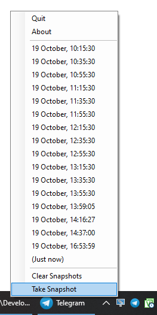

# WindowsLayoutSnapshot

  

Ever switched monitor configurations on your laptop and all of your windows are squished down in size and in the wrong position? Ever unplugged from docking station with multiple monitors to go to a meeting? Ever wanted to minimize all windows but save their layouts and min-max'ed states for later?

WindowsLayoutSnapshot is a windows app to remember and restore window sizes and positions.

You can download the binary from the [release page](../../releases).
There's no installer; you can just put it in your Startup folder.

The app takes a "snapshot" of your windows layouts every thirty minutes.  You can see the list of snapshots when you click on the tray menu icon.

## Features

* When there are many stored snapshots, all very recent ones are shown, plus more spaced-out but distant past snapshots.
* Automatically taken snapshots are shown in normal text.  Manually taken snapshots (`Take Snapshot`) command are shown in **bold**.
* As you mouse over each snapshot, it is restored, so it's easy to find the layout you want.
* Snapshots keep track of, and restore, the "normal size" of windows even if they're currently minimized or maximized.
* This app makes sure all windows fit inside a currently-visible display when restoring snapshots.  Because of that, if you ever have a window that's off-screen because of a bug in other software, just restore the "(Just now)" snapshot.
* On a dual/multi-monitor setup a snapshot is taken before display power down (due to energy saving settings) and automatically restored after wake-up. This works around a specific issue I've had with my installation. After wake-up, window positions get restored correctly across the monitors.

## Pitfalls

* Snapshots are not stored across app instances (or, thus, restarts).

## Screenshot

## License

See `LICENSE` file.

## Credits

Originally created by [Lapo Luchini](https://github.com/lapo-luchini), modernized and maintained by me 😇
